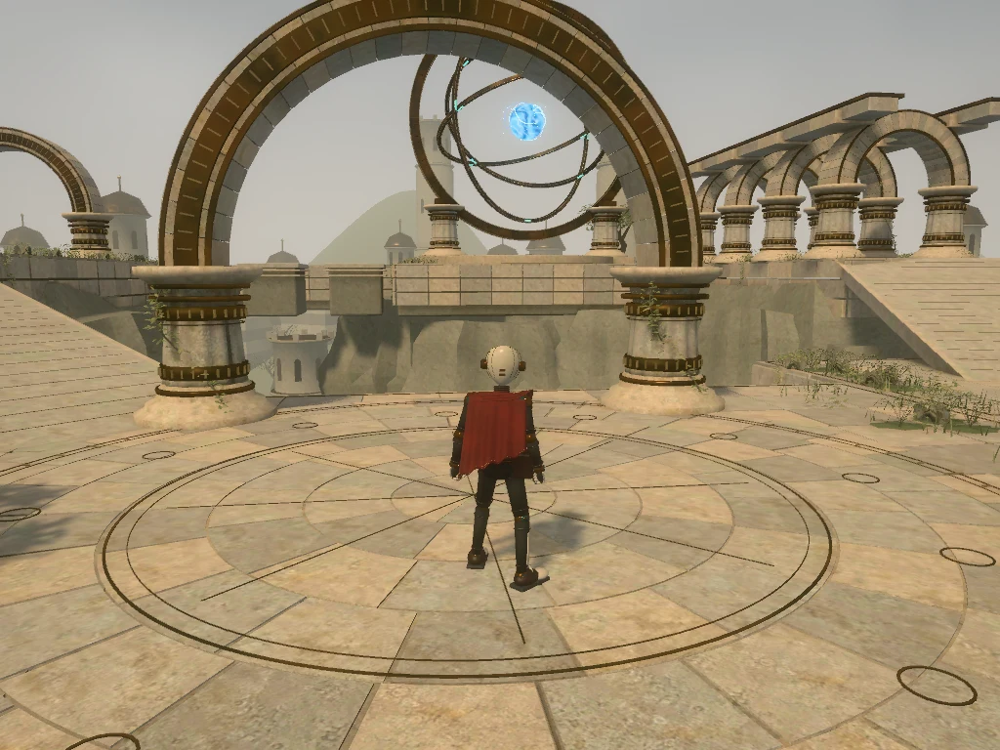

# The Sunken Observatory

A third-person exploration showcase for PlayCanvas Web Components 0.22.0 and Engine 2.22.0.



## Run and controls

From the repository root, run `npm ci`, `npm run build`, then `npm run serve -- -l 3737`.
Open [the example](http://localhost:3737/examples/third-person-controller), or choose **Controls → Third Person Controller** in the example browser. It starts as soon as the first camera frame is ready.

- Desktop: WASD/arrows move, Shift sprints, Space jumps once per press, drag orbits, and the wheel zooms. Vertical camera control is inverted.
- Touch: left-side drag moves, right-side drag looks, and a right-side double tap jumps. Coarse-pointer devices start in light quality.
- Esc/Pause pauses; Continue resumes. R/Reset returns to arrival. Leaving the canvas keeps playing; hiding the tab pauses. Input is released on focus loss.

## Code ownership

| File                                                                           | Responsibility                                                                                                                          |
| ------------------------------------------------------------------------------ | --------------------------------------------------------------------------------------------------------------------------------------- |
| [HTML](../../examples/third-person-controller.html)                            | Assets and decoders, hierarchy, camera/post-processing, lighting, physics, controller tuning and animation clips                        |
| [Scene script](../../examples/assets/scripts/observatory-scene.mjs)            | Choose animation from motion/grounding, match playback speed, assemble invisible collision, manage pause/reset, quality and location UI |
| [Controller adapter](../../examples/assets/scripts/observatory-controller.mjs) | Extend the Engine controller for drag-to-look, press-only jumping, focus cleanup and camera restoration                                 |
| [Page module](../../examples/js/observatory.mjs)                               | Loading progress and asset/application error presentation                                                                               |

The character's six clips use `<pc-anim>` and `<pc-anim-clip>`. Takeoff and landing declare `loop="false"`; JS calls the element's `transition()` and sets `speed`. Movement, camera smoothing, collision avoidance and device mappings remain owned by the installed Engine controller.

The environment's `<pc-anim clip="Observatory_Loop">` plays a Blender-authored 720-second loop. Nested rings rotate around their parent axes; the energy core floats and spins. A `<pc-node>` binds its cyan light to the core. No monument update script is needed.

Engine 2.22 detaches controller inputs on destruction, not disable. Pause removes its `<pc-script-instance>`; resume remounts through PWC and restores continuous camera angles. The adapter's Engine-private accesses are contained in one file and must be rechecked on an Engine upgrade. The explicit gamepad dead-zone high value avoids the Engine 2.22 default's zero normalization range.

Simulation retains the Engine's 0.1-second hitch cap. Fall recovery uses simulation time, so pause freezes recovery. HTML owns initial pitch/distance; JS overrides yaw for optional review viewpoints.

## Assets and rendering

The original ceramic-and-brass Owl Wayfarer has 71 exported joints and six locomotion clips. Its animation/skeleton source is Quaternius's CC0 Universal Animation Library; these are authored clips, not mocap. See [provenance and license](motion-source/README.md). Original geometry and authoring scripts use the repository's MIT license. The [limestone texture source and generation prompt](textures/README.md) are included.

A separate collision GLB supplies smooth ramps and broad camera obstacles. The collider matches the monument's 96-sided, 5.3 m radius dais. Decorative foliage has no physics. [asset-tuning.json](asset-tuning.json) records decoded bounds and grounding. The character wrapper preserves metre scale and glTF +Z facing. Animation supplies poses while the controller supplies world motion; there is no terrain foot IK or runtime cloth simulation.

Both quality modes use baked architectural AO, dynamic sun shadows, HDR CameraFrame rendering and restrained bloom. Light quality caps pixel ratio at 1 and shadows at 1024; high quality caps them at 2 and 2048. Neither runs SSAO or performs a startup bake.

| Delivery                                           |      Bytes |
| -------------------------------------------------- | ---------: |
| Environment GLB                                    | 12,455,268 |
| Character GLB                                      |  2,106,152 |
| Collision GLB                                      |     19,256 |
| Total GLBs                                         | 14,580,676 |
| HDR sky                                            |    463,823 |
| Draco/Basis WASM and glue, before HTTP compression |  1,016,354 |

GLBs use Draco geometry and KTX2/Basis ETC1S textures. All 26 images have power-of-two dimensions and mipmaps; no UASTC is used. Position and skin data are retained exactly; normals use 12-bit and UVs 16-bit quantization. The compressor rejects already compressed input.

Architectural AO covers 39 static meshes in five regional atlases. Moving rings, energy core, character and collision never enter the bake. Cycles bakes 2048-square maps at 64 samples, 1.5 m range and 0.65 strength; delivery filters them to 1024-square ETC1S maps. At the measured desktop WebGL2 arrival view (1024 × 768), median GPU time improved from 9.27 to 7.99 ms and draw submissions fell from 307 to 232 against the SSAO path using the same geometry. This costs 1.37 MB extra download and about 3.33 MiB of AO texture memory on the tested GPU, plus UV storage. It is not a mobile performance guarantee.

## Rebuild assets

The example runs from delivered assets. Blender and offline tools are only needed for authoring.

1. Start Blender with the Blender MCP add-on listening on `127.0.0.1:9876`.
2. Install tools: `npm ci --prefix utils/third-person-controller`.
3. Put the `bin` directory from [KTX-Software 4.4.2](https://github.com/KhronosGroup/KTX-Software/releases/tag/v4.4.2) on `PATH`.
4. From the repository root:

```powershell
node utils/third-person-controller/blender.mjs utils/third-person-controller/create_scene.py full
node utils/third-person-controller/compress.mjs output/third-person-controller/source/uncompressed examples/assets/models
node --max-old-space-size=4096 utils/third-person-controller/verify-compression.mjs output/third-person-controller/source/uncompressed examples/assets/models
```

The full generator includes environment detail, fitted surfaces, AO, monument animation, skinned character and walk smoothing. It preserves other Blender scenes. Editable scenes, raw GLBs and generated maps go under ignored `output/third-person-controller/source/`.

Use `environment` instead of `full` for only the environment, or run `create_character.py` through the bridge for only the character. Always recompress afterward; compression expects all three raw GLBs from an initial full build. The compact CC0 motion reference and limestone source needed for a fresh build are included here.

Targeted tools: `bake_ao.py` (optionally a region such as `center` after a full bake), `animate_environment.py`, `energy_core.py`, `smooth_rocks.py`, and `review_character.py`. `surface_geometry.py` owns fitted surfaces; `smooth_walk.py` filters baked pelvis corrections without runtime offsets. One-off migrations and historical captures are excluded.

`smooth_rocks.py` softens the support cliffs with 75% averaged corner normals while preserving creases of 55° or more. Full builds include this step. Only the valley rock batch is affected; silhouettes, collision, texture coordinates and architectural AO remain unchanged. These cliffs are not AO receivers, so this shading adjustment requires no rebake.

## Validation

```powershell
npm test
npm run lint
npm run type-check
npm ci --prefix utils/third-person-controller
npm run test:observatory-assets
python utils/third-person-controller/surface_geometry_test.py
```

Input/state regressions run in the normal Examples suite; declarative animation regressions run in Integration. CI also installs asset dependencies and decodes the shipped GLBs to check walk continuity, skin data, monument hierarchy/animation, collision and AO bindings. It needs neither Blender nor KTX-Software.

For geometry changes, also run `audit-surfaces.mjs examples/assets/models/observatory-environment.glb 0.003 --check`, `audit_ao_uv.py` on the raw export, and `verify-ao-geometry.mjs BEFORE.glb AFTER.glb` for an AO-only rebake.

Review viewpoints: `?view=arrival`, `ascent`, `crossing`, `colonnade`, or `overlook`. Add `&backend=webgl2` to force WebGL2; default uses PWC's backend selection. See [verification.md](verification.md) for results and remaining device checks.
